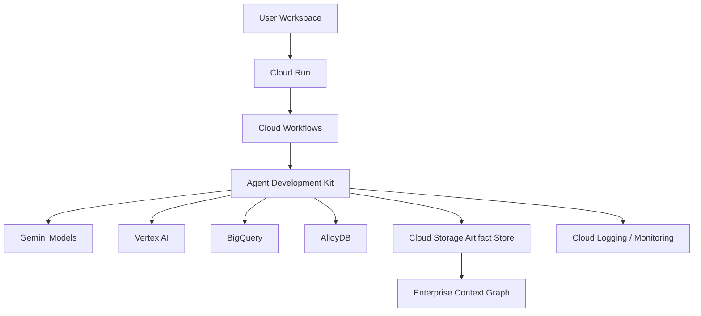

# Architecture

## High-Level Architecture

```mermaid
flowchart LR
    A[Legacy Platforms] --> B[Metadata And Artifact Ingestion]
    B --> C[Enterprise Context Graph]
    C --> D[Agent Orchestrator]
    D --> E[Specialized AI Agents]
    E --> F[Generated Artifacts]
    F --> G[Human-In-The-Loop Review]
    G --> H[Approved Migration Package]
    H --> I[Modern Cloud Data Platform]
    I --> J[Continuous Optimization]
```

## Core Components

### 1. Enterprise Context Graph

The Enterprise Context Graph stores and connects:

- Schemas
- Tables
- Columns
- SQL
- Stored procedures
- ETL jobs
- BI reports
- Metadata
- Lineage
- Business rules
- Transformation logic
- Human approvals
- Validation evidence
- Migration decisions

This becomes the platform's reusable modernization memory.

### 2. Agent Orchestrator

The orchestrator coordinates specialized agents across long-running enterprise workflows.

It manages:

- Task sequencing
- Agent dependencies
- Context sharing
- Human review gates
- Artifact generation
- Retry and exception handling
- Audit logging

### 3. Specialized AI Agents

Agents perform specific modernization tasks such as discovery, assessment, mapping, SQL conversion, validation and cutover planning.

### 4. Human-In-The-Loop Governance

Humans remain in control of critical decisions:

- Architecture approval
- Mapping review
- DDL review
- SQL review
- Validation review
- Deployment approval
- Governance sign-off

### 5. Artifact Store

Stores generated artifacts:

- Assessment reports
- Mappings
- DDL
- SQL
- Validation reports
- Runbooks
- Roadmaps
- Audit logs

## Google Cloud Reference Architecture

## Design Principles

- Context-first before code generation
- Human approval before production decisions
- Deterministic evaluation where possible
- Clear maturity labels: available, coming soon, future vision
- Enterprise traceability and auditability
