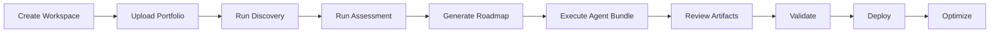

# Product Journey

## User Journey

1. Visit website
2. Understand modernization problem
3. Explore product journey
4. Review maturity assessment
5. Explore AI agents
6. Review sample artifacts
7. Open case studies
8. Contact founder / initiate engagement

## Customer Journey

1. Discovery workshop
2. Portfolio upload
3. Maturity assessment
4. Enterprise assessment
5. Pilot wave selection
6. AI-assisted modernization
7. Human review
8. Validation
9. Cutover planning
10. Production rollout
11. Hypercare
12. Expansion

## Product Workflow

