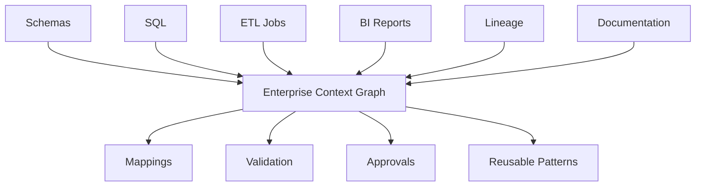

# Enterprise Context Graph Diagram

```mermaid
graph TD
    A[Schemas] --> G[Enterprise Context Graph]
    B[SQL] --> G
    C[ETL Jobs] --> G
    D[BI Reports] --> G
    E[Lineage] --> G
    F[Documentation] --> G
    G --> H[Mappings]
    G --> I[Validation]
    G --> J[Approvals]
    G --> K[Reusable Patterns]
```
